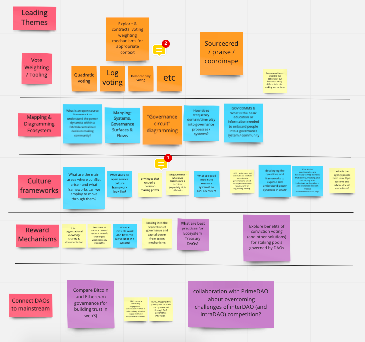

# Ground Control

### **Our Team, a.k.a. Ground Control:**

* [Nathalia Scherer](https://twitter.com/natscherer_) – Token Engineering Academy, formerly DAOstack
* [Livia Deschermeyer](https://twitter.com/_liviade) – Token Engineering Commons, Commons Stack
* [Jessica Zartler](https://twitter.com/JessicaZartler) – Commons Stack, Token Engineering Commons, Block Science
* [Jeff Emmett](https://twitter.com/jeffemmett) – Commons Stack, BlockScience
* [Andrej Berlin](https://twitter.com/deepwork_studio) – Deep Work Studio
* [Renzo D’Andrea](https://twitter.com/RenzoDan5) – Change the River
* [James Waugh](https://twitter.com/jwaup) – NEAR, Commons Stack \(Trusted Seed Member\)
* [Eugene Leventhal](https://twitter.com/bbeats1) – Smart Contract Research Forum, Metagov, CyLab @ CMU
* [Angela Kreitenweis](https://twitter.com/akrtws) – Founder of Token Engineering Academy

### Proposed Research Questions ~ July 9:

